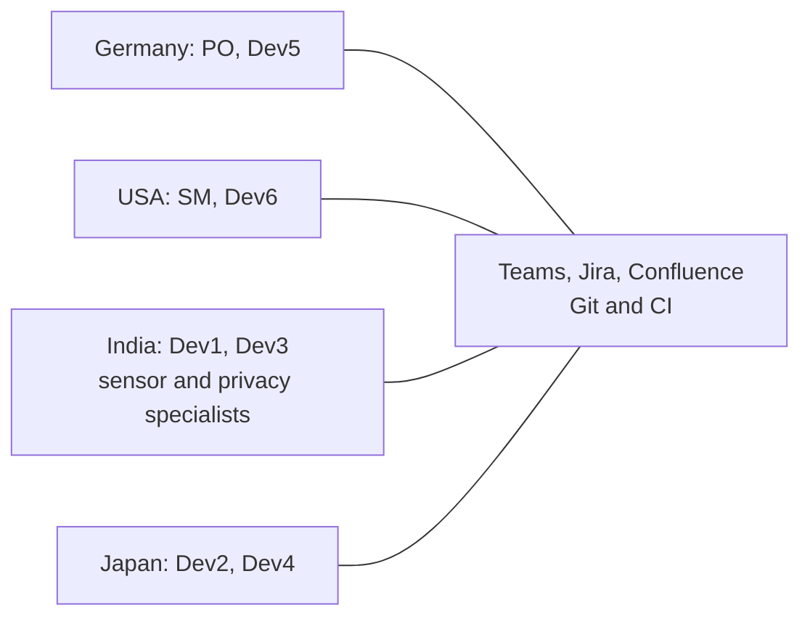

# Analysis of an Intercultural and Diverse Team

## Cover Page

**Use case title:** Development of a Mobile Fitness App by a Global Intercultural Scrum Team  
**Working group:** G4  
**Group members:**
**Course:** IKHT, BINT24, Provadis Hochschule  
**Instructor:** Prof. Dr. Lamya Abdullah  
**Submission date:** 18 August 2026  

---

## Table of Contents

1. Executive Summary  
2. Introduction  
3. Use Case Overview  
4. Team Composition and Diversity Profile  
5. Detailed Case Narrative  
6. Problem Analysis  
7. Theoretical Analysis  
8. Proposed Solutions and Improvement Strategies  
9. Outcome and Evaluation  
10. Reflection and Lessons Learned  
11. Conclusion  
Glossary  
References  
AI Usage Declaration  

---

## List of Figures

**Figure 1.** Distributed team and collaboration boundary.  

## List of Tables

**Table 1.** Team composition and responsibilities.  
**Table 2.** Project milestones and performance expectations.  
**Table 3.** Time-zone overlap during June 2026.  
**Table 4.** Diagnostic summary using GRPI and Belbin.  
**Table 5.** Recommendations, implementation and limitations.  
**Table 6.** Evaluation indicators.  

## List of Abbreviations

**AI** - Artificial Intelligence  
**CEST** - Central European Summer Time  
**DISC** - Dominance, Influence, Steadiness, Conscientiousness  
**DoD** - Definition of Done  
**EDT** - Eastern Daylight Time  
**GRPI** - Goals, Roles, Processes, Interpersonal relationships  
**IST** - India Standard Time  
**JST** - Japan Standard Time  
**MVP** - Minimum Viable Product  
**MoSCoW** - Must have, Should have, Could have, Won't have  
**PO** - Product Owner  
**RACI** - Responsible, Accountable, Consulted, Informed  
**SM** - Scrum Master  
**UTC** - Coordinated Universal Time  

---

## 1. Executive Summary

Global Scrum Team G4 develops a mobile fitness app between June 2026 and February 2027. Eight employees work remotely from Germany, the United States, India and Japan. The fixed launch date leaves eleven three-week sprints, while the product scope remains flexible. An empty overlap between normal working hours prevents regular meetings with all four sites. Therefore, the team needs a collaboration model that does not depend on simultaneous attendance.

A typical risk appears during an architecture meeting. German and US members interpret silence as consent, while Indian and Japanese members may signal caution indirectly. Power-distance expectations, communication context and individual preferences can reinforce this difference (Abdullah, 2026a, pp. 22-27). The case treats these frameworks as working hypotheses. National scores describe tendencies at group level. They cannot predict individual conduct (Hofstede et al., 2010).

The analysis combines Hall, Hofstede, Tuckman, Belbin, GRPI, conflict-management concepts and research on psychological safety. It identifies three connected risks: hidden disagreement, unclear decision rights and unequal access to live discussions. The proposed response uses written decisions, named owners, rotating meeting times and mandatory responses to critical proposals. Collaborative leadership and explicit conflict procedures support these practices (Aritz & Walker, 2014, pp. 72-92; Edmondson, 1999, pp. 375-376).

The team has recorded an initial delay at Milestone 1. No final project result exists yet. Therefore, the report presents later outcomes as forecasts and defines indicators for testing them. The expected result is a reduced but stable release after Sprint 11. That forecast depends on early implementation of the team charter, decision rules and specialist backups.

## 2. Introduction

The fictional case concerns a software company that forms a temporary Scrum team from existing employees. The product combines workout tracking, progress statistics, wearable integration and social functions. These features connect technical delivery with privacy, security and international user expectations. The company selected the team through availability instead of deliberate role design. That choice makes the case relevant to intercultural and heterogeneous teamwork.

The report examines how composition, communication, leadership and cultural diversity affect team performance. It also studies the effect of personality preferences, age, gender, education and professional expertise. The practical objective is a set of operating rules for the first two sprints. The academic objective is to connect observed events with established team and intercultural frameworks.

The analysis covers project formation and the first two sprints. It uses later developments only as conditional scenarios. DISC and Belbin profiles are assumed case data. No validated assessments took place. English proficiency, individual cultural identities and prior international experience remain unknown. Budget and wider organisational culture also fall outside the available evidence.

The report treats intercultural and team-process factors as central explanations for the case. The fictional data support this focus through diversity, remote work and missing working agreements. The cited theories explain plausible mechanisms, but interviews, observations and organisational records are unavailable. A real project could instead fail because of deadline pressure, rushed staffing, product complexity or limited resources. Together, these alternatives would reduce the explanatory weight of culture.

## 3. Use Case Overview

Management appoints a German PO and a US SM. Six developers from other teams volunteer for the project and are then assigned to it full-time without any remaining links to their former teams. All developers work full-stack, although Dev1 and Dev3 hold specialist knowledge in sensor integration and data protection. The team shares an employer, English working language and corporate tools. It has no shared project history and has never met in person.

The business objective is a market-ready release in February 2027. The deadline remains fixed. The PO can reduce scope through MoSCoW prioritisation. A potentially releasable increment is expected after every sprint. The DoD requires automated tests, review by another developer, English documentation and no known critical defects. The launch target requires a crash-free rate above 99 per cent.

The PO represents product stakeholders and accepts increments. The SM facilitates the process and removes impediments. Management assigns the developers exclusively to this project for its duration. Users, beta testers, app-store reviewers and data subjects depend on product quality and privacy decisions. No external customer participates directly in internal decisions.

The case starts with several favourable conditions: common employment, established tools, technical education and volunteer motivation. It also starts without agreed meeting rules, decision rights or component ownership. A successful postcondition includes a stable release, traceable decisions and reusable team norms. A failure scenario includes hidden risks, technical rework and reactive scope cuts near launch.

**Figure 1. Distributed team and collaboration boundary.** Digital tools connect four sites, but they do not create common working hours.

**Table 1. Team composition and responsibilities.**

| Member | Location, age and gender | Main responsibility | Case profile |
|---|---|---|---|
| PO | Germany, 30, female | Backlog, prioritisation, acceptance | Belbin Coordinator/Completer Finisher; DISC C/D |
| SM | USA, 45, female | Facilitation, impediments, team climate | Teamworker/Coordinator/Resource Investigator; DISC I/S |
| Dev1 | India, 55, male | Full-stack; sensors and mobile performance | Specialist/Implementer/Completer Finisher; DISC C |
| Dev2 | Japan, 39, male | Full-stack | Implementer/Teamworker; DISC D/S |
| Dev3 | India, 65, male | Full-stack; architecture and data protection | Specialist/Coordinator/Completer Finisher; DISC C/S |
| Dev4 | Japan, 23, male | Full-stack implementation | Implementer/Teamworker; DISC S |
| Dev5 | Germany, 31, male | Full-stack implementation | Implementer/Teamworker; DISC S/C |
| Dev6 | USA, 25, male | Full-stack; tools and external contacts | Resource Investigator/Shaper; DISC I/D |

**Table 2. Project milestones and performance expectations.**

| Milestone | Sprint | Deliverable |
|---|---:|---|
| M1 | 2 | Architecture, technology and team charter agreed |
| M2 | 5 | Internal alpha for tracking and statistics |
| M3 | 8 | Beta with wearable integration and external testers |
| M4 | 10 | Feature freeze and social functions complete |
| M5 | 11 | Release candidate, store submission and launch |

The overview treats roles, full-time allocation, milestones and the Definition of Done as stable operating conditions. These conditions come from the case design; no contracts, backlog history or capacity records confirm their practical application. A real team could face hidden line-management duties or uneven technical readiness. Changing stakeholder demands could also affect the team's capacity and priorities. Therefore, an apparent communication problem could instead result from weak governance or insufficient resources.

## 4. Team Composition and Diversity Profile

The team combines formal and informal authority. The PO controls product priorities, while the SM facilitates the Scrum process. Dev1 and Dev3 hold informal authority through specialist knowledge. Full-stack staffing permits flexible handovers across sites. However, missing component ownership creates uncertainty about architecture, quality and privacy accountability.

Belbin describes the typical contributions that team members make (Belbin, 2010, pp. 22-23). Four members carry an Implementer role, and several carry Completer Finisher roles. Therefore, the team has strong execution and detail orientation. It has no Plant for creative alternatives and no Monitor Evaluator for independent assessment. Abdullah links missing or duplicated roles to weaker team balance (Abdullah, 2026b, pp. 19-24).

DISC adds an individual preference lens. Five members show strong Steadiness or Conscientiousness tendencies. These profiles support reliable work, but they may delay dissent until evidence feels complete. Dev6 prefers faster exploration, while Dev1 and Dev3 prefer detailed validation. Their difference can improve technical decisions when the process protects both stages.

National background adds possible expectations about hierarchy and communication. Hofstede's country scores show the largest case spreads in long-term orientation and uncertainty avoidance (see appendix: Hofstede's country comparison table). However, Minkov and Kaasa question the internal consistency of Hofstede's uncertainty-avoidance index (Minkov & Kaasa, 2021, p. 384). Therefore, this report does not use that dimension to predict individual behaviour. It records preferences for structure through direct team feedback instead.

Hall distinguishes high-context communication from low-context communication. High-context messages depend strongly on relationships and shared cues. Low-context messages state meaning explicitly (Hall, 1976, p. 91). German and US members may expect explicit disagreement, while Japanese and Indian members may use contextual signals. A Teams message removes tone, status cues and immediate clarification. Therefore, the recipient can read efficiency as hostility or caution as agreement.

The team spans 42 years of age and includes two women in formal leadership roles. Age and specialist expertise give Dev1 and Dev3 a different source of status than the organisational chart. A gender-based explanation would exceed the available evidence. The relevant indicators are interruptions, ignored decisions, delayed responses and repeated challenges to assigned authority. The team should evaluate those behaviours without assigning motives in advance.

Educational diversity offers another explanation for different work habits. The German and US profiles emphasise structured application, presentation and project work. The Indian and Japanese profiles emphasise technical competition and extensive workplace training. These descriptions remain assumptions because individual histories are absent. A questionnaire in Sprint 1 should collect degrees, work experience, language confidence and preferred learning methods. Its results may support or disprove the current profile.

The profile treats assigned DISC and Belbin roles as relevant to the members' actual behaviour. It applies the same logic to broad cultural and educational tendencies. The fictional case provides these classifications, but validated assessments and individual biographies are not created. Seniority, specialist dependence, English confidence or temporary workload could produce the same participation patterns. Individual interviews, behavioural observations and repeated self-assessments could therefore weaken the diversity-based explanation.

## 5. Detailed Case Narrative

Phase 1 covers team formation in Sprint 0. Management assigns the PO and SM, while six developers volunteer for the product. The first calls remain informal and irregular. The SM invites open participation, and the PO expects prepared input. Nobody defines how the team records decisions or handles silence.

Phase 2 covers the first architecture discussion. Dev6 proposes a fast MVP and accepts limited technical debt. The PO, Dev2, Dev4 and Dev5 prefer a durable architecture. Dev1 and Dev3 mention sensor and privacy risks with cautious wording. The meeting ends without owners for those risks, although several participants perceive agreement.

Phase 3 begins when a wearable dependency blocks a Sprint 2 story. The relevant Indian specialist cannot join the US meeting because it occurs outside his working hours. A German participant then writes, "Why was the integration not completed?" The Japanese recipient reads public criticism, while the Indian specialist reads exclusion from his own domain. No one checks either interpretation during the same working day.

Phase 4 shows escalation from task conflict to relationship conflict. The SM attempts an informal reconciliation, but the team has no written conflict process. M1 misses its Sprint 2 target. The delay provides evidence of process weakness. It does not prove a national cause. Incomplete technical estimates or dependency risks remain plausible alternative explanations.

Phase 5 begins with a structured retrospective. The team proposes a charter, decision log, response rule and rotating meeting schedule. Dev1 and Dev3 receive review responsibility in their specialist domains, with named backups. These measures constitute planned corrective action rather than proven success. Sprints 3 to 5 must show whether they reduce decision delay and rework.

The chronology links ambiguous communication and missing decision rules to the M1 delay. The described sequence supports this connection, but interviews and communication logs are unavailable. Therefore, this narrative alone cannot establish a reliable causal relationship. A typical alternative is that hardware complexity exceeded the original estimates. Limited specialist availability or ordinary coordination problems could cause the same delay. Another recipient might also read the quoted message as routine status control. Ticket timestamps, meeting records and separate interviews could distinguish these explanations.

## 6. Problem Analysis

The first challenge is pseudo-consensus, which means apparent agreement without shared commitment. A typical scenario occurs when one member raises a risk indirectly and receives no follow-up question. Direct communicators consider the topic closed, while cautious members continue to object privately. The risk returns after implementation and creates rework. Explicit responses can reveal the disagreement before work begins.

The second challenge concerns authority and accountability. The PO owns product priority, the SM owns process quality, and specialists influence technical choices. These boundaries exist in principle, but the team has no decision matrix. Therefore, technical disagreements can become personal contests over status. A RACI matrix can separate the person doing work from the person holding final accountability (Abdullah, 2026b, pp. 13-17).

The third challenge follows directly from geography. Normal working hours create no common interval across all four sites. The USA and Japan have a five-hour gap even before Germany and India enter the calculation. One possible all-hands slot is 10:00 UTC. This means 06:00 in the eastern USA and 19:00 in Japan. Repeating that slot would distribute access and inconvenience unequally. Working early leads to tiredness while working late leads to exhaustion. Consequently colleagues from both the USA and Japan are negatively affected in their performance.

**Table 3. Time-zone overlap during June 2026.**

| Site | Assumed zone | Local working hours | UTC working hours |
|---|---|---|---|
| USA East Coast | EDT, UTC-4 | 09:00-17:00 | 13:00-21:00 |
| Germany | CEST, UTC+2 | 09:00-17:00 | 07:00-15:00 |
| India | IST, UTC+5:30 | 09:00-17:00 | 03:30-11:30 |
| Japan | JST, UTC+9 | 09:00-17:00 | 00:00-08:00 |

The fourth challenge is the fixed date with flexible scope. Dev6 may favour visible progress, while specialists may protect architecture and privacy. This task conflict can improve decisions because it exposes the costs of both options (Jehn et al., 1999, p. 745). It becomes harmful when the team hides assumptions or attacks a person. The decision log should record the chosen trade-off and its review date.

Conflict styles increase this risk. The case expects competing behaviour from the PO and collaborating behaviour from the SM. Dev1 and Dev2 may avoid conflict, while Dev3 and Dev4 may accommodate. Their silence resembles passive communication during the meeting. The German message is assertive in purpose, but its public wording may appear aggressive. No case evidence supports passive-aggressive conduct. These classifications describe behaviour. They do not define national character (Abdullah, 2026a, p. 30).

A process conflict can escalate through five steps: ambiguous message, missed indirect response, assumed decision, late technical problem and public correction. The final correction threatens trust and turns the issue into relationship conflict. Collaborative problem-solving interrupts this sequence through fact clarification, perspective-taking and follow-up (Abdullah, 2026c, pp. 42-44). The SM should mediate within 48 hours and document the agreed action.

The analysis connects pseudo-consensus, unclear authority and unequal meeting access. Missing owners, incompatible working hours and the delayed dependency support this diagnosis. Conflict theory also explains how these conditions can escalate (Abdullah, 2026c, pp. 42-44). However, the case provides no interviews, survey data or communication logs. Product uncertainty, seniority, specialist bottlenecks or unrealistic planning could independently produce the same conflict. A Sprint 1 baseline could compare response times, participation, dependency age and reopened decisions. This comparison would prevent the team from attributing the conflict prematurely to culture.

## 7. Theoretical Analysis

Hofstede's model compares cultural tendencies at national level. Power distance concerns acceptance of unequal authority, while individualism concerns the relation between individual and group goals (Abdullah, 2026a, pp. 22-23). In this case, these dimensions suggest different expectations about speaking up and public responsibility. They do not justify predictions about a named member. Direct observation must decide whether the hypothesis fits.

Hall's context theory explains a concrete communication failure. The sentence "Why was the integration not completed?" carries little relational information. Hall defines high-context communication as relying more on surrounding context and implicit meaning, while low-context communication makes meaning more explicit (Hall, 1976, p. 91). Applying this distinction to the case, a low-context sender may see a precise request for facts, while a high-context recipient may infer blame from wording, audience and hierarchy. Adding purpose, private context and a requested next step reduces this ambiguity.

Tuckman describes forming, storming, norming and performing as stages of group development (Tuckman, 1965, pp. 396-397). Sprint 0 reflects forming because members seek roles and acceptable conduct. The Sprint 2 conflict marks an early transition into storming. No evidence supports a norming or performing diagnosis yet. Therefore, later stages remain targets rather than observed results.

Belbin explains the team's role imbalance. Implementers convert plans into action, while Completer Finishers protect detail and deadlines (Belbin, 2010, p. 22). The missing Plant weakens structured idea generation. The missing Monitor Evaluator weakens independent review. A rotating challenge role can provide the missing function without assigning a permanent personality label.

GRPI examines goals, roles, processes and interpersonal relationships. Goals are clear at the launch level, but backlog trade-offs remain disputed. Formal roles exist, while technical accountability remains diffuse. Processes lack response rules and asynchronous inclusion. Relationships remain fragile because the team has no shared history.

**Table 4. Diagnostic summary using GRPI and Belbin.**

| Area | Case evidence | Risk | Required response |
|---|---|---|---|
| Goals | Fixed date and flexible scope | Repeated priority conflict | MoSCoW criteria and trade-off log |
| Roles | PO/SM defined; technical ownership diffuse | Delay and specialist bottlenecks | RACI ownership and backups |
| Processes | No response or escalation rule | Exclusion and pseudo-consensus | Asynchronous decision protocol |
| Relationships | No shared history; critical message in Sprint 2 | Low trust and face threat | Predictable feedback and mediation |
| Belbin balance | Many Implementers; no Monitor Evaluator | Execution without independent review | Rotating challenge role |

Leadership is formally distributed between PO and SM, while technical influence remains lateral. The PO currently shows a directive style: she expects prepared input and retains final authority over backlog order. This approach supports fast scope decisions under the fixed deadline, but it can reinforce silence during technical exploration. The SM shows a cooperative style because she invites participation and attempts informal reconciliation. The approach also creates more input, but leader-led meetings and the missing conflict process leave participation uneven. Transformational leadership remains underdeveloped because neither leader has yet translated the product goal into a shared purpose with individual support. Aritz and Walker's study specifically links directive and cooperative leadership styles to different levels of participation and inclusion in multicultural groups (Aritz & Walker, 2014, pp. 79-88; Abdullah, 2026c, pp. 13-19). Therefore, the current leadership is effective for formal coordination but insufficient for inclusion and team development.

A suitable leadership sequence assigns each style to a specific situation. The PO should act directively when deciding backlog order, release scope and urgent compliance issues. The SM should use cooperative leadership for planning and retrospectives, while collecting input from every site. Both leaders should use transformational leadership to connect daily work with the release purpose and individual development. Developers then add technical evidence asynchronously before the PO makes a scope decision. This combination preserves Scrum accountability and strengthens participation across locations.

Psychological safety means a shared belief that interpersonal risk-taking is safe (Edmondson, 1999, p. 354). It does not remove performance standards. A member should be able to report a blocker or challenge a proposal without humiliation. The leader supports this climate through predictable reactions and visible follow-up. Anonymous pulse checks can test whether members experience that safety.

The analysis transfers six theoretical approaches to a fictional Scrum setting. The cited literature supports their concepts, but conceptual fit does not confirm their application to this team. For example, silence can indicate power distance, high-context communication, a DISC preference or a missing challenge role. One might therefore treat several matching labels as stronger evidence. That approach would count the same observation as independent evidence several times. A socio-technical interpretation could instead focus on time zones, tool choice, task dependence and formal authority. Therefore, each model must produce a separate prediction that the team can test through observed behaviour.

## 8. Proposed Solutions and Improvement Strategies

The Sprint 2 retrospective should introduce eight linked measures. Each measure addresses an observed event and includes an owner. The team should test the first version for three sprints. A review in Sprint 5 should retain, change or remove each rule. This treatment makes the charter an experiment instead of permanent bureaucracy.

**Table 5. Recommendations, implementation and limitations.**

| Recommendation | Expected benefit | Implementation | Owner and timing | Potential challenge |
|---|---|---|---|---|
| Written decision protocol | Earlier dissent and traceable trade-offs | Record question, options, evidence, owner, deadline and review date; require agree, concern or question from every site | SM, Sprint 1 | Written rounds can add one-day latency |
| RACI decision matrix | Clear authority and fewer ownership gaps | Assign product, process, architecture, privacy and quality decisions; name one backup per specialist | PO and SM, Sprint 1 | Too much detail can create administrative work |
| Async-first collaboration | Equal access across time zones | Use Teams for updates, Jira for work, Confluence for decisions and Git for reviews; reserve calls for conflict and complex design | SM, Sprint 1 | Text supports tasks better than relationships |
| Fair meeting rotation | Shared burden from inconvenient hours | Rotate two all-hands slots and record attendance outside local hours | SM, each sprint | Rotation distributes inconvenience without removing it |
| Structured disagreement | Legitimate critical review | Rotate a Monitor Evaluator function; the reviewer states the strongest counterargument before closure | Developers, Sprint 2 | The role may initially feel artificial |
| Specialist pairing and quality gates | Reduced bottlenecks and transferred knowledge | Pair Dev1 and Dev3 with backups; require tests, pull-request review and documentation before Done | Developers, Sprint 2 | Pairing reduces short-term delivery capacity |
| Conflict protocol | Faster repair of trust damage | Describe event, impact and request; SM mediates within 48 hours; escalate scope to PO and capacity to management | SM, Sprint 1 | Avoiding members may still delay reporting |
| Cultural and language check-in | Evidence about actual preferences | Collect language confidence, preferred feedback channel and meeting constraints through a short private survey | SM, Sprint 1 | Self-reports may differ from later behaviour |

Digital media should follow the purpose of the interaction. Shared documents support updates, documentation and task tracking. Video supports conflict resolution, brainstorming and relationship building (Abdullah, 2026d, pp. 8-9). Therefore, the team should not move every exchange into text. Rotating pair calls can preserve relational contact without requiring eight people simultaneously.

One concrete feedback rule can prevent repetition of the Sprint 2 incident. A reviewer first names the artefact and observed issue. The reviewer then states the delivery impact and requests a specific next step. For example: "The wearable ticket lacks the device matrix. This blocks compatibility testing. Please add the matrix or flag the dependency by 15:00 UTC." The message remains direct without assigning blame.

The recommendations rely on explicit rules and sufficient management support. Aritz and Walker's findings support cooperative leadership as a way to promote more balanced participation and inclusion in intercultural groups, but the team has not tested any proposed measures (Aritz & Walker, 2014, pp. 87-88). One might treat a mandatory response as evidence of agreement. That interpretation would confuse visible compliance with genuine acceptance by team members. Extensive documentation may also slow decisions, while pairing may reduce short-term capacity.

## 9. Outcome and Evaluation

The case provides one observed result: M1 is delayed after the unresolved wearable dependency. It also records a corrective decision during the Sprint 2 retrospective. No evidence yet shows improved collaboration, stable velocity or a successful release. Therefore, all later outcomes remain forecasts. This distinction prevents planned actions from appearing as achieved results.

The forecast expects clearer ownership and earlier risk reporting by Sprint 5. The team may still reduce social functions to protect wearable stability and privacy. Diversity can improve that choice through four market perspectives. For example, Dev6 can propose a social feature, while Dev3 tests its privacy assumptions. Japanese and German members can then test acceptance and documentation needs. This combination expands the solution space and adds critical review. Stahl and colleagues show that such benefits depend on team processes (Stahl et al., 2010, pp. 692-693, 705).

**Table 6. Evaluation indicators.**

| Objective | Indicator and method | Baseline | Sprint 5 target | Owner |
|---|---|---:|---:|---|
| Inclusive participation | Major decisions with written input from all four sites, decision-log audit | Measure in Sprint 1 | At least 90% | SM |
| Reliable coordination | Decisions reopened because context was missing | Measure in Sprint 1 | Below 10% | SM |
| Early risk detection | Critical risks recorded before implementation | Measure in Sprint 1 | 100% of known domain risks | Dev1 and Dev3 |
| Quality | Stories meeting the DoD on first review | Measure in Sprint 1 | At least 85% | Developers |
| Psychological safety | Anonymous four-item pulse on a 1-5 scale | Sprint 1 mean | Increase of at least 0.5 | SM |
| Capacity stability | Actual hours divided by planned hours per site | Measure in Sprint 1 | At least 90% | PO |
| Delivery stability | Velocity variation across three sprints | Sprints 1-3 | Within 15% by Sprint 5 | PO |

The evaluation links changes after Sprint 2 to the proposed measures. It also treats the numerical targets as indicators of meaningful improvement. However, the delayed M1 milestone remains the only observed project result. The case provides no historical baseline, comparison team or empirical basis for the thresholds. Familiarity, scope reduction or easier backlog items could improve results without the proposed measures. Extensive documentation could also reduce delivery velocity despite healthier team collaboration.

## 10. Reflection and Lessons Learned

Team members need to separate intention from effect. A direct request can protect delivery and still damage the relationship. An indirect warning can preserve respect and still hide a blocker. Therefore, every member must confirm meaning and use the agreed escalation route. Shared rules reduce the need to interpret personality or nationality.

Project managers should not staff a time-critical global team through availability alone. The current composition includes useful expertise, but it lacks independent review and clear backups. A staffing review should examine role balance, time-zone coverage, language confidence and distributed-team experience. These criteria connect resource planning with delivery risk.

Organisations need more than a communication platform. They must protect overlap time, define matrix priorities and maintain accessible decision records. Digital tools support coordination, while people create trust and shared meaning (Abdullah, 2026d, pp. 10-15). Management should also recognise work outside local hours and distribute that burden transparently. Otherwise, global collaboration transfers hidden costs to specific sites.

## 11. Conclusion

Global Scrum Team G4 has sufficient technical breadth for the mobile fitness app. Its central problem is an operating model that depends on implicit agreement and unavailable common meeting time. The Sprint 2 incident shows how a task dependency can become a relationship issue. Unclear authority and missing ownership increase that risk.

The theoretical analysis assigns a specific use to each framework. Hall guides message design, GRPI guides process design and Belbin guides review responsibilities. Tuckman identifies the transition from forming to storming. Collaborative leadership supports participation, while clear Scrum accountability preserves decision speed.

The primary recommendation is a written team charter with decision rights, response rules and a conflict process. An async-first workflow gives every site access to work and decisions. Rotating meetings, pair calls and specialist backups address the limits of written coordination. Sprint 5 metrics will show whether these measures improve behaviour and delivery.

The expected outcome remains conditional. Early intervention can support a smaller and stable release by Sprint 11. Continued pseudo-consensus would instead create late rework and reactive scope cuts. The team should therefore treat communication rules and trust measures as delivery controls.

## Glossary

**Asynchronous communication:** Collaboration in which participants contribute at different times.  
**Belbin team role:** A preferred contribution to teamwork, such as Implementer or Monitor Evaluator.  
**Direct communication:** Explicitly stated meaning with little reliance on inference.  
**GRPI:** A diagnostic model covering goals, roles, processes and interpersonal relationships.  
**High-context communication:** Communication that relies strongly on relationships, context and implied meaning.  
**Low-context communication:** Communication that states meaning explicitly and relies little on shared context.  
**MoSCoW:** Prioritisation into Must, Should, Could and Won't have items.  
**Psychological safety:** Shared belief that interpersonal risks can be taken without punishment or humiliation.  
**Pseudo-consensus:** Apparent agreement that hides unresolved objections.  

## References

Abdullah, L. (2026a). *Lecture Notes 02: Person Types and Communication*. Provadis Hochschule.

Abdullah, L. (2026b). *Lecture Notes 04: Teams 2.0 and Organization*. Provadis Hochschule.

Abdullah, L. (2026c). *Lecture Notes 05: Leadership and Conflict Management*. Provadis Hochschule.

Abdullah, L. (2026d). *Lecture Notes 06: Digital Collaboration*. Provadis Hochschule.

Aritz, J., & Walker, R. C. (2014). Leadership styles in multicultural groups: Americans and East Asians working together. *International Journal of Business Communication, 51*(1), 72-92. https://doi.org/10.1177/2329488413516211

Belbin, R. M. (2010). *Team roles at work* (2nd ed.). Butterworth-Heinemann.

Edmondson, A. C. (1999). Psychological safety and learning behavior in work teams. *Administrative Science Quarterly, 44*(2), 350-383. https://doi.org/10.2307/2666999

Hall, E. T. (1976). *Beyond culture*. Anchor Books.

Hofstede, G., Hofstede, G. J., & Minkov, M. (2010). *Cultures and organizations: Software of the mind* (3rd ed.). McGraw-Hill.

Jehn, K. A., Northcraft, G. B., & Neale, M. A. (1999). Why differences make a difference: A field study of diversity, conflict, and performance in workgroups. *Administrative Science Quarterly, 44*(4), 741-763. https://doi.org/10.2307/2667054

Minkov, M., & Kaasa, A. (2021). A test of Hofstede's model of culture following his own approach. *Cross Cultural & Strategic Management, 28*(2), 384-406.

Stahl, G. K., Maznevski, M. L., Voigt, A., & Jonsen, K. (2010). Unraveling the effects of cultural diversity in teams: A meta-analysis of research on multicultural work groups. *Journal of International Business Studies, 41*, 690-709. https://doi.org/10.1057/jibs.2009.85

Tuckman, B. W. (1965). Developmental sequence in small groups. *Psychological Bulletin, 63*(6), 384-399. https://doi.org/10.1037/h0022100

Hofstede, G., & Hofstede, G. J. (n.d.). Country comparison bar charts. https://geerthofstede.com/country-comparison-bar-charts/

## AI Usage Declaration

| AI tool used | Purpose of use | Extent of generated content | Verification process performed by authors |
| ------------ | -------------- | --------------------------- | ----------------------------------------- |
| GitHub Copilot | Bullet points were checked for gaps based on the Report Structure and Task Description | Some gaps were found and filled in by the group members | The AI output was checked against the Report Structure and Task Description |
| GitHub Copilot | The main text was checked for inconsistencies | Existing inconsistencies were discussed and resolved as a group | The discussion of the inconsistencies was used to check whether they made sense |
| Perplexity - Kimi K3 | For some of Hofstede's dimensions, AI was used to help classify the team and provide examples | Bullet points about Hofstede's dimensions were used as a basis for the report | The explanations were checked to see if they made sense and fit the table of values for the four nations across all of Hofstede's dimensions |
| Perplexity - Kimi K3 | Research was done to find out whether scientific sources were available online in plain text | Links to scientific sources were obtained | It was checked whether the source was the desired one |

The group remains responsible for the final argument, source verification and submitted wording.

## Appendix

#### Hofstede's country comparison table
| **Dimension**                | **Germany** | **USA** | **India** | **Japan** | **Spread** |
| ---------------------------- | ----------- | ------- | --------- | --------- | ---------- |
| Power Distance (PDI)         | 35          | 40      | 77        | 54        | **42**     |
| Individualism (IDV)          | 67          | 91      | 48        | 46        | **45**     |
| Masculinity/Femininity (MAS) | 66          | 62      | 56        | 95        | **39**     |
| Uncertainty Avoidance (UAI)  | 65          | 46      | 40        | 92        | **52**     |
| Long-Term Orientation (LTO)  | 83          | 26      | 51        | 88        | **62**     |
| Indulgence (IVR)             | 40          | 68      | 26        | 42        | **42**     |

(Hofstede, G., & Hofstede, G. J. (n.d.))